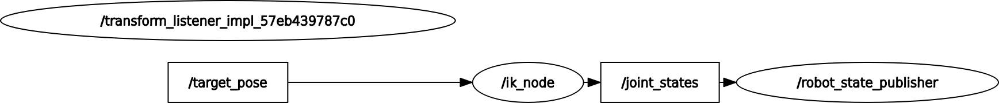

# my_spine_robot
### Node and Topic

## Dependency

## Setup
```bash
$ cd ~/ros2_ws/src  #Go to ros workspace
$ git clone https://github.com/iHaruruki/spina_inverse_kinematics.git #clone this package
$ cd ~/ros2_ws
$ colcon build --symlink-install
$ source install/setup.bash
```
## Usage
```bash
```
### Description
## URDF test
```
$ ros2 launch urdf_tutorial display.launch.py model:=~/ros2_ws/src/spina_inverse_kinematics/urdf/spina_robot.urdf
```
## License
## Authors
## References
